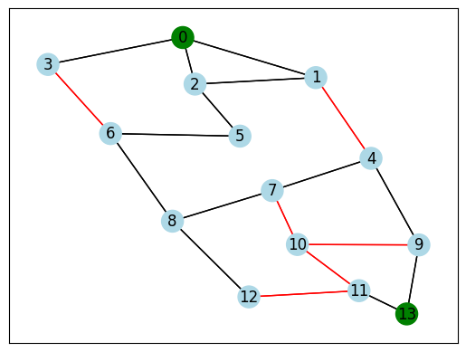
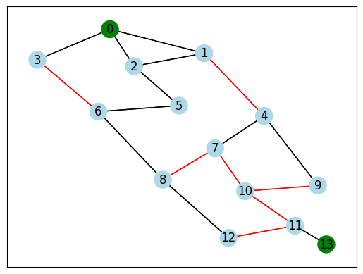

# Shannon Switching Game

*Author: Martine Toering*

This repository implements a game for two players on a graph called **Shannon Switching Game**, as proposed by Claude Shannon sometime around 1950. The project is implemented in `python`.

In Shannon Switching Game, two players play on an undirected graph with a pair of **special nodes**, *A* and *B*. Each edge in the graph can either be *colored* or *removed*.
The players, called *Short* and *Cut*, take turns. Short can *color* an edge red each turn, while Cut can *delete* an uncolored edge.

The goals of the players are opposed. While Short has the goal of making a colored path between the two special nodes, Cut has the goal of separating the two nodes so that no path is available between them.

<p float="left">
  
  

  <sup>Example of a move in the Shannon Switching game where Short colored the edge between node 7 and 8. Special nodes are colored in green.</sup>
</p>

The graph is implemented with an adjacency matrix as its representation. The strategy of the players is simply choosing a random edge.

## How to run

### Dependencies

See `pyproject.toml` for the packages needed for this project. Poetry version 1.7.1 was used. To install, run the following (e.g. in a new environment):

```bash
poetry install --without dev
```

### Graph states

To run the program, we need to provide an *input file* which describes the graph (nodes and edges) and decide which player goes first. Input files are provided in the folder `input`.

Example of a graph state, as specified in `input/example_graph_1.txt`:

```
N # number of nodes
10
S  # index of special nodes
0 9
E  # edges between two nodes
0,1
0,2
0,5
1,3
2,4
3,4
1,5
5,6
1,6
4,7
4,8
7,8
8,9
7,9
7,6
6,9
```

### Start game

We can start the game with:

```bash
python main.py --input <input_file> --player <player>
```

where <player> indicates which player goes first, and <input> is the input file.

To run the Shannon Switching Game with input file `example_graph_1.txt` where Short will go first:

```bash
python main.py --input input/example_graph_1.txt --player short
```

## Implementation details

For our implementation, we divide the logic into objects of `Graph` type and `Game` type. A `Graph` object will store and modify the state of the graph, while a `Game` object will store and check the players and the winning state. In this, we use the concept of *Composition* (as opposed to *Inheritance*) by using the `Graph` class in the `Game` class. We prefer composition here over Inheritance because there is no need to modify the `Graph` class in the `Game` class, we will only make use it (intuitively, there is a *has a* relation).

We also have the option for a `VisGraph` object instead of a `Graph` object, where we will make use of inheritance by having `Graph` as a parent class of `VisGraph` (intuitively, there is a *is a* relation). `VisGraph` is used for adding functionality that plots the graph states using `networkx`. A jupyter notebook `visualization.ipynb` is provided which can visualize the graphs during the game.
